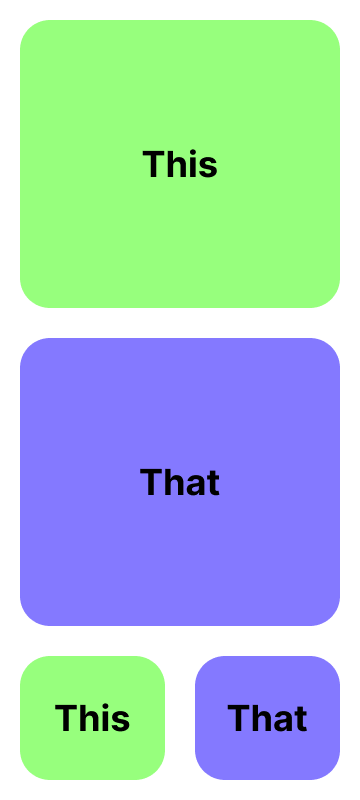
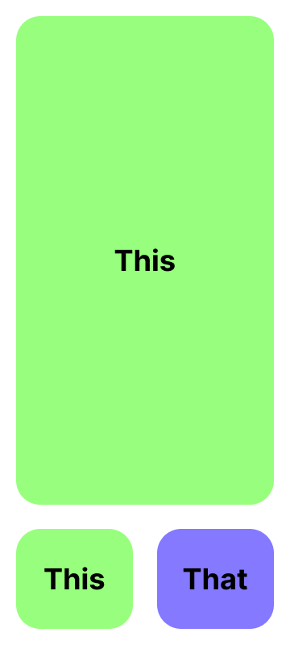
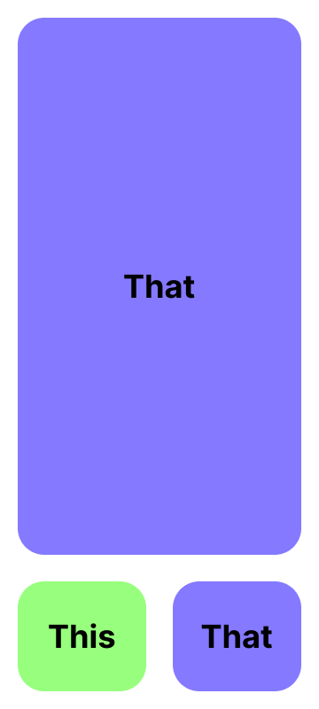

# This-and-That

A Figma design converted into React Native using Locofy

# Links:

<table>

<tr>
<th>
Platform
</th>
<th>
Link
</th>
</tr>

<tr>
<td>
Figma
</td>
<td>

https://www.figma.com/community/file/1258689995235847502

</td>
</tr>

<tr>
<td>
YouTube
</td>
<td>
</td>
</tr>

</table>

# About:

In this project, I converted a [Figma Design](https://www.figma.com/community/file/1258689995235847502) to React native Application using [Locofy](https://www.locofy.ai/).

# Design:

